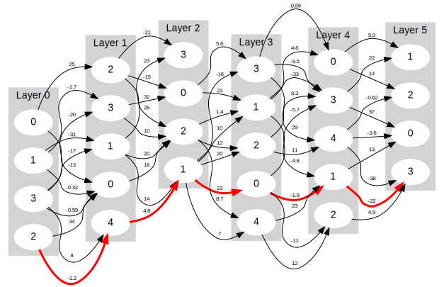

Shortest Path
=============
I got asked a question like this in an interview, and I don't think I gave a
very good answer.  Here's a good answer.

```console
$ <examples/complex.txt ./shortestpath | dot -Tsvg >examples/complex.svg
```


```console
$ RAND_SEED=1337 ./randomgraph | ./shortestpath | dot -Tsvg >examples/random.svg
```



The input format is one line per layer, where each layer is a sequence of space
(or tab) separated edges `from to weight`, e.g.
```console
$ cat examples/simple.txt
0 0 5    1 0 4    2 1 3
0 1 6    1 0 10   1 1 9

$ <examples/simple.txt | ./shortestpath | dot -Tsvg >examples/simple.svg
```


`shortestpath` only retains in memory edges that might end up part of a minimal
path. You can stream in layers forever -- depending on the graph you might not
run out of memory for a long time.

To build the code and generate the examples, run `make`. `make clean` deletes
everything generated by `make`.
```console
$ make clean
rm -f shortestpath.d shortestpath.o shortestpath randomgraph
find examples/ -type f \( -name '*.dot' -o -name '*.svg' \) -delete

$ make
g++ --std=c++20 -O2 -Wall -Wextra -pedantic -Werror -MMD  -c -o shortestpath.o shortestpath.cpp
g++ -o shortestpath shortestpath.o
./shortestpath <examples/simple.txt >examples/simple.dot
dot -Tsvg examples/simple.dot >examples/simple.svg
./shortestpath <examples/complex.txt >examples/complex.dot
dot -Tsvg examples/complex.dot >examples/complex.svg
./shortestpath <examples/dupey.txt >examples/dupey.dot
dot -Tsvg examples/dupey.dot >examples/dupey.svg
g++ --std=c++20 -O2 -Wall -Wextra -pedantic -Werror -o randomgraph randomgraph.cpp
RAND_SEED=1337 ./randomgraph >examples/random.txt
./shortestpath <examples/random.txt >examples/random.dot
dot -Tsvg examples/random.dot >examples/random.svg
```

